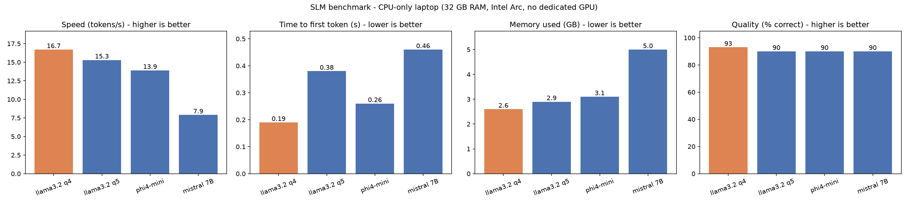

# SLM Benchmark Lab: Local AI Assistant


Which small language model should a bank run on a **normal work laptop**, with no GPU, no cloud, and no data leaving the machine? And can a small model be made **reliable** enough to fill in real HR forms?

This project is pure **inference engineering**: it runs and measures existing models, and never trains anything. It benchmarks four local models for speed, time to first token, memory, and quality; serves the winner through a validated **FastAPI** service; makes structured output reliable with **Pydantic validation, grounding rules, and retries**; measures the effect of **temperature**; and presents everything in a **React + Recharts dashboard**.



## Hardware

All results come from one laptop: **CPU only**, 32 GB RAM, Intel Arc integrated graphics (no dedicated GPU). Ollama ran every model **100% on the CPU**. Results on a GPU machine would differ.

---

## Phase 1: Local inference and benchmarking

### Results

| Model | Time to first token | Speed (tokens/s) | Memory | Quality (30 questions) |
|---|---|---|---|---|
| **llama3.2 3B q4_K_M** | **0.19 s** | **16.7** | **2.6 GB** | **28/30** |
| llama3.2 3B q5_K_M | 0.38 s | 15.3 | 2.9 GB | 27/30 |
| phi4-mini | 0.26 s | 13.9 | 3.1 GB | 27/30 |
| mistral 7B | 0.46 s | 7.9 | 5.0 GB | 27/30 |

Quality by skill (5 questions each):

| Model | Maths | Knowledge | General | Tone | Reasoning | Extraction |
|---|---|---|---|---|---|---|
| llama3.2 q4 | 4/5 | 5/5 | 5/5 | 5/5 | 4/5 | 5/5 |
| llama3.2 q5 | 3/5 | 5/5 | 5/5 | 5/5 | 4/5 | 5/5 |
| phi4-mini | 4/5 | 5/5 | 4/5 | 5/5 | 4/5 | 5/5 |
| mistral 7B | 5/5 | 5/5 | 5/5 | 5/5 | 2/5 | 5/5 |

### Decision: llama3.2 3B q4_K_M

It was the fastest, the quickest to start, the lightest, and the most accurate. Mistral 7B used about twice the memory at half the speed, with no quality gain. The choice is driven by these measurements, not by which model is popular.

### Key findings

- **Speed follows file size on CPU.** Each generated token requires reading the whole model from memory, so a model twice the size runs at roughly half the speed.
- **Q4 vs Q5 (quantization):** on typing speed, the two swapped places across sessions (14.6 vs 14.1, 17.2 vs 18.3, 16.7 vs 15.3 tokens/s), so they are **effectively tied**. On time to first token, Q4 was faster in both clean runs (0.26 vs 0.44 s, 0.19 vs 0.38 s). Quality was 28/30 vs 27/30. Q4 is the better artifact for this laptop.
- **Everyday tasks are solved even by small models:** 100% on knowledge, tone classification, and information extraction. **Maths and multi-step reasoning** are the weak spots, so calculations should be done in code, not by the model.
- **Cold starts dominate real usage.** From the request log: the first request took 7.8 s to the first word (loading the model), the next one 0.26 s. Mistral's cold start was 11.3 s to the first word and 35 s in total.
- **Longer inputs start slower:** two warm requests took 0.26 s (75 characters) and 0.55 s (127 characters) to the first word.

### Measurement lessons

- **Repeating the same prompt makes TTFT look falsely fast** (0.07 s), because Ollama reuses work on a prompt it has just seen. The benchmark uses different questions per run.
- **Changing the prompt to avoid that cache changed the answers** (a strange prefix led to 8-token answers). The final benchmark uses varied, real questions instead.
- **Session-to-session speed varies by 15 to 20%** (temperature, power, background apps), while runs within a session agree closely. Differences smaller than about 5% are treated as ties.

### Method

- `benchmark.py`: each model is unloaded first, then 1 warm-up run (load time recorded), then 3 timed runs on different questions with streaming, to measure time to first token. Settings: temperature 0, max 200 tokens. Memory is read from Ollama while the model is loaded.
- `quality.py`: 30 questions in 6 categories, graded by keyword match after normalising case, commas, and hyphens. Every answer is saved, and all failures were checked by hand.
- `report.py`: merges both into `results/report.csv` and `results/report.png`.

---

## The assistant API (FastAPI)

`app.py` serves the benchmark winner with the same settings that were tested.

| Endpoint | What it does |
|---|---|
| `GET /health` | Checks that Ollama is running and the default model is installed |
| `POST /ask` | Answers a question; returns the answer plus `ttft_seconds`, `tokens_per_second`, and `seconds` |
| `POST /leave-request` | Turns a free-text leave request into a validated form (Phase 2) |

- Bad requests (empty, more than 2,000 characters, or a model not on the allow-list) get **422** before the model is called. If Ollama is down: **503**. If the model's output is still invalid after the retry: **502**.
- **Every `/ask` request is logged** to `logs/requests.jsonl` (time, model, status, TTFT, tokens/s, latency). **Raw questions are never logged**, only their length, because staff may type customer details into the assistant.

---

## Phase 2: Determinism and constraints

### The task: HR leave requests

`POST /leave-request` turns a message like *"I'd like 3 days of sick leave starting next Monday because of the flu"* into:

```json
{
  "status": "ok",
  "request": {
    "leave_type": "sick",
    "start_date": "2026-10-05",
    "end_date": "2026-10-07",
    "working_days": 3,
    "reason": "flu",
    "notes": []
  },
  "attempts": 1,
  "first_try_valid": true
}
```

### How reliability is enforced (`leave.py`)

1. **Pydantic validation:** the model must return JSON matching a strict schema (allowed leave types, real dates). Every response is validated before it leaves the API.
2. **Grounding rules** (the model may not fill in what the employee did not say):
   - the **leave type** must be supported by words in the message,
   - the **reason** must appear in the message,
   - a **number of days** is only used if the employee actually wrote it.
3. **Code does the calendar maths:** working days are counted by code, and weekend start or end dates are moved to the nearest working day, with a note. The model never counts days.
4. **"I don't know" is allowed:** a `missing` field lets the model ask for clarification instead of inventing a form.
5. **Retry once, then fail gracefully:** if checks fail, the model gets its own answer back with the exact problems, and one chance to fix them. If it still fails, the API returns **502** with the list of problems.

Model mistakes (to be retried) are kept separate from **request problems**, for example leave on a Saturday only, which are answered with a clarification for the employee.

### Variance study: temperature 0 vs 0.7

`variance_study.py` runs **15 leave messages × 5 runs × 2 temperatures** (150 runs), against an answer key (`leave_cases.json`) with "today" fixed at Friday 2 October 2026.

| Measure | Temperature 0 | Temperature 0.7 |
|---|---|---|
| First-try valid | 59% | 60% |
| Rescued by retry | 84% | 83% |
| Not failed | 93% | 93% |
| Correct | 73% | 69% |
| **Silently wrong** (`ok` but incorrect) | **7%** | **7%** |
| **Consistency** (same answer across 5 runs) | **100%** | **83%** |

**Findings:**
- **Temperature 0 makes the system fully repeatable** (100% consistency, vs 81% and 83% at 0.7 across two studies). This was the one effect that held in both runs.
- **The retry is what makes the system usable:** only about 60% of answers pass on the first try, but the retry rescues more than 80% of the failures, so about 93% of runs end sensibly.
- **Consistent does not mean correct:** at temperature 0, some messages were wrong in all 5 runs. Temperature controls randomness; accuracy has to come from rules and prompts.
- **A difference that did not replicate:** in the first study, first-try validity was 52% at temperature 0 vs 39% at 0.7; in the second, 59% vs 60%. With 75 runs per temperature, that difference is not reliable, and is reported as such.

**Decision:** temperature 0 plus one retry for structured output.

### A bias found by measurement

The first study showed that when no leave type was given, the model **defaulted to "unpaid"**. In an HR system, that means a salary deduction nobody asked for. Adding leave-type grounding changed the results at temperature 0 (`compare_variance.py`):

| Measure | Before | After |
|---|---|---|
| Correct | 60% | 73% |
| **Silently wrong** | **20%** | **7%** |

---

## Phase 3: Dashboard

A small **React + Recharts** app (`dashboard/`) shows speed, time to first token, memory, quality, the temperature study, and the before/after effect of grounding. Values appear on hover. `export_dashboard_data.py` collects the Python results into `dashboard/public/data.json`, which the page reads.

---

## Known limitations

- **One laptop, CPU only.** Results on other hardware will differ.
- **Small test sets:** 30 quality questions, 15 leave messages. Keyword grading can be fooled; all failures were checked by hand.
- **Relative and single dates:** llama3.2 3B does not reliably resolve "today", "tomorrow", or single dates ("on 12 October"). The system fails safely by asking for clarification. A future improvement is to resolve relative dates in code with a date-parsing library.
- **One remaining silent error:** "next Monday and Tuesday" was booked as Monday only, because no number of days was stated to check against.
- **Load times vary** with Windows file caching; treat them as rough guidance.
- **Factual errors happen:** in one test, the assistant stated that AML is a subset of KYC (it is the other way around). For policy and compliance questions, answers should come from documents with citations (see the secure bank RAG assistant project), not from the model's memory.

## Tech stack

The roadmap was written for Node.js; this project uses the Python equivalents:

| Roadmap (Node) | This project |
|---|---|
| ollama JS client | ollama Python client |
| Fastify / Express | FastAPI |
| Zod | Pydantic |
| React + Recharts | React + Recharts |

## How to run

Requires Python 3.14, Node.js, and [Ollama](https://ollama.com) with the four models pulled.

```bash
python -m venv .venv
.venv\Scripts\Activate.ps1          # Windows PowerShell
pip install -r requirements.txt

python benchmark.py                  # speed, TTFT, memory  -> results/speed.json
python quality.py                    # 30-question quality  -> results/quality_answers.json
python report.py                     # CSV + chart          -> results/report.*
python variance_study.py             # temperature study    -> results/variance.json

uvicorn app:app --reload             # API docs at http://127.0.0.1:8000/docs

python export_dashboard_data.py      # -> dashboard/public/data.json
cd dashboard
npm install
npm run dev                          # dashboard at http://localhost:5173
```

## Tests and CI

```bash
pytest -v
```

24 tests cover the API (good requests, rejected requests, Ollama down, request logging), the leave-request logic (validation, grounding, weekends, retries, clarifications), and the question set. The model is replaced by scripted fakes, so tests run in under a second with no models, and **GitHub Actions** runs them on every push.

## Project structure

```
app.py                   FastAPI service (/health, /ask, /leave-request)
leave.py                 Leave-request extraction: schema, grounding, retry
benchmark.py             Speed, TTFT, memory benchmark
quality.py               30-question quality test
questions.json           Quality questions and answer keys
report.py                Combined CSV + chart
leave_cases.json         15 leave messages with expected answers
variance_study.py        Temperature 0 vs 0.7 study
compare_variance.py      Before/after comparison of the grounding fix
export_dashboard_data.py Builds dashboard/public/data.json
dashboard/               React + Recharts dashboard
tests/                   pytest suite (no live models needed)
results/                 All measured outputs
.github/workflows/       CI: runs pytest on every push
```